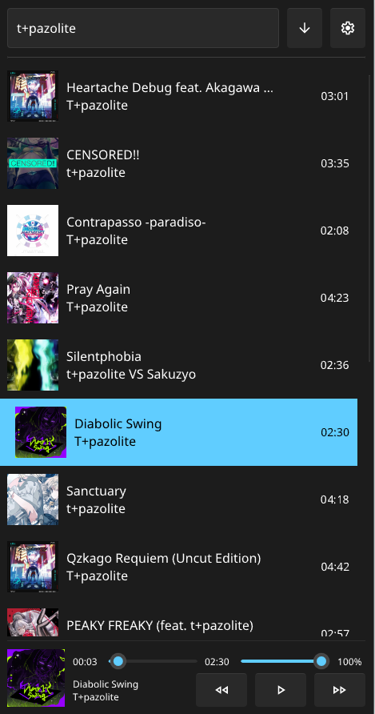

# N Music

Cross-platform music player written in Rust + Slint

## Features

- Cover art
- Support media control (Only Linux and Android)
- Extremely fast and resource efficient

## Coming

- Android builds:
    - [x] Kotlin code
    - [x] Notifications
    - [x] Working dev build
    - [ ] Automatic CI for releases

- Streaming:
    - [ ] Simple web streaming
    - [ ] Youtube streaming
    - [ ] Deezer streaming

- QoL:
    - [ ] Playlists
    - [ ] Media control for Windows and Mac
    - [ ] Auto updater (desktop only; opt-out)

## Contribute

### Translations

If your language isn't fully supported by N Music, you can add a language by creating a file in `n_player/assets/lang`.
The file must be a JSON file and its name should be like this: `it_Italiano.json`; `it` is the denominator of the
language, `Italiano` is the name of the language in that language (i.e. how it should be displayed in the app).

You can copy the english file and rename it correctly and start translating, then to check if everything works correctly
you can compile and run a debug build, the language will automatically be added to the supported languages during
compilation.
