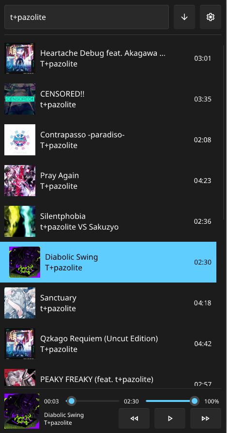

# N Music

Cross-platform music player written in Rust + Slint



## Features

- Cover art
- Music from local folders, plus web playlists and Telegram chats on desktop
- Supports media control on all platforms (Windows, Mac, Linux and Android)
- Extremely fast and resource efficient
- Locale support

## Coming

- Streaming:
    - [ ] Simple web streaming
    - [ ] Youtube streaming
    - [ ] Deezer streaming

- QoL:
    - [ ] Playlists
    - [ ] Auto updater (desktop only; opt-out)

## Contribute

### Building

Run in debug mode:

```shell
cargo run --package n_music_desktop
```

Build in release mode:

```shell
cargo build --release --package n_music_desktop
```

### Telegram

Signing in to Telegram needs N Music's API credentials when building. Register an app at
[my.telegram.org](https://my.telegram.org) and pass its id and hash:

```shell
N_MUSIC_TELEGRAM_API_ID=12345 N_MUSIC_TELEGRAM_API_HASH=0123456789abcdef \
  cargo run --package n_music_desktop
```

Without them, the app builds and runs as before, with the Telegram source turned off. Release
builds take them from the `N_MUSIC_TELEGRAM_API_ID` and `N_MUSIC_TELEGRAM_API_HASH` secrets.

### Translations

If your language isn't fully supported by N Music, you can add a language by creating a file in
`n_music_desktop/assets/lang` (and its copy in `n_music_android/assets/lang`).
The file must be a JSON file and its name should be like this: `it_Italiano.json`; `it` is the denominator of the
language, `Italiano` is the name of the language in that language (i.e. how it should be displayed in the app).

You can copy the english file and rename it correctly and start translating, then to check if everything works correctly
you can compile and run a debug build, the language will automatically be added to the supported languages during
compilation.
